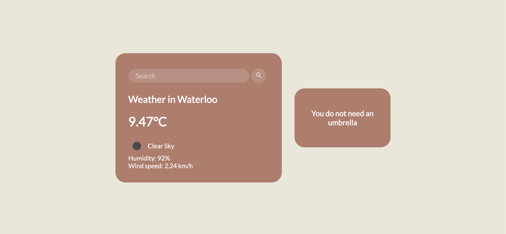

# umbrella

Javascript weather application that lets the user know whether they'd likely need an umbrella depending on their location's current climate conditions

###Next Steps
- [ ] Implement geolocation instead of having the user manually searching their location
- [ ] More varied weather warnings/messages in the current umbrella section

 
